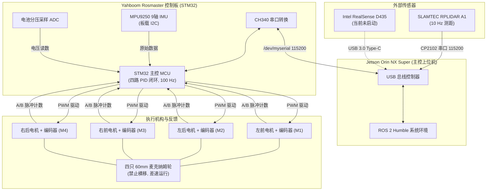
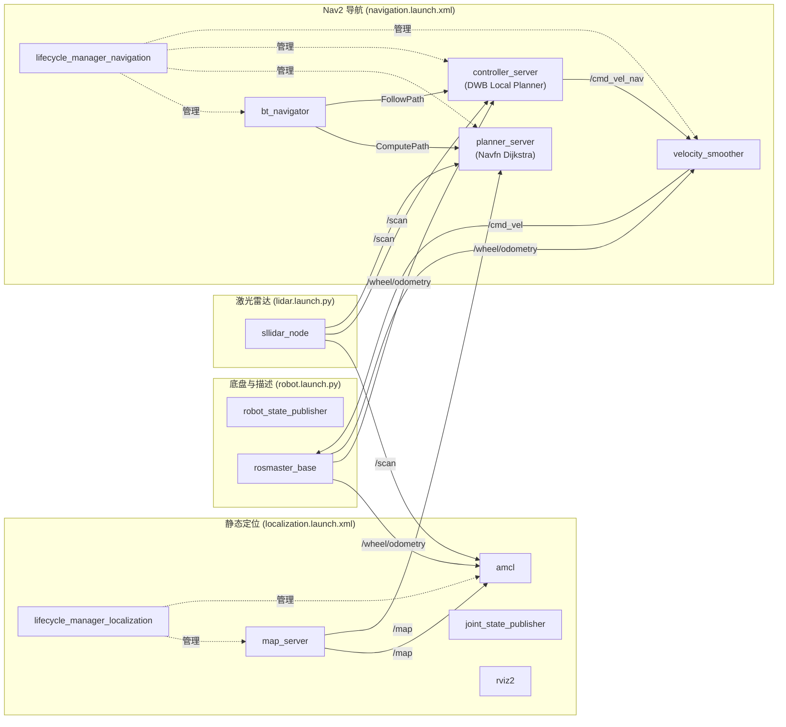
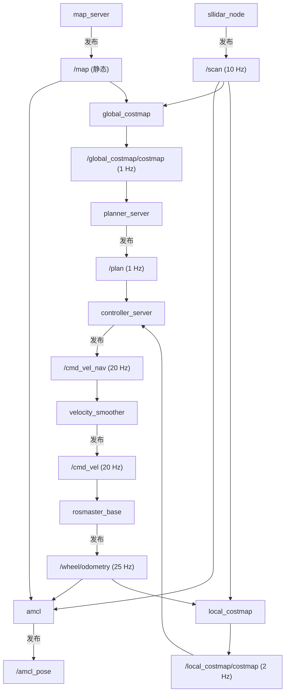
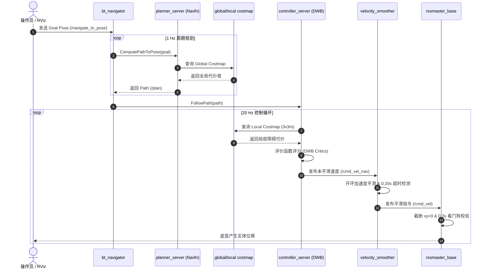
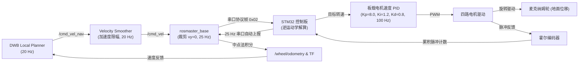
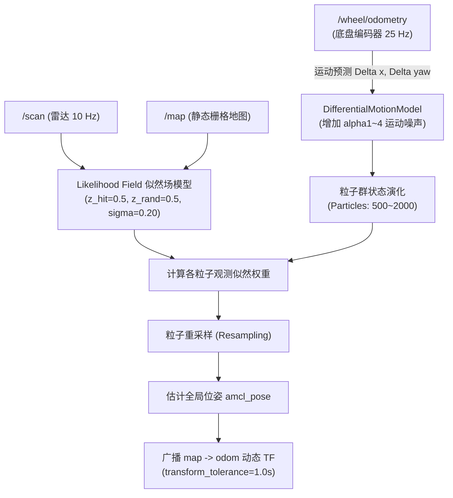
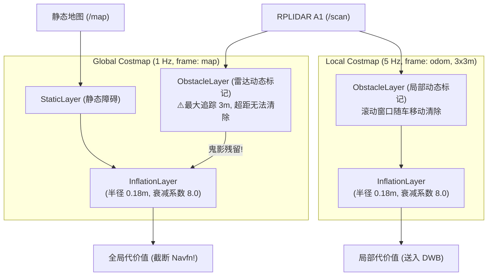
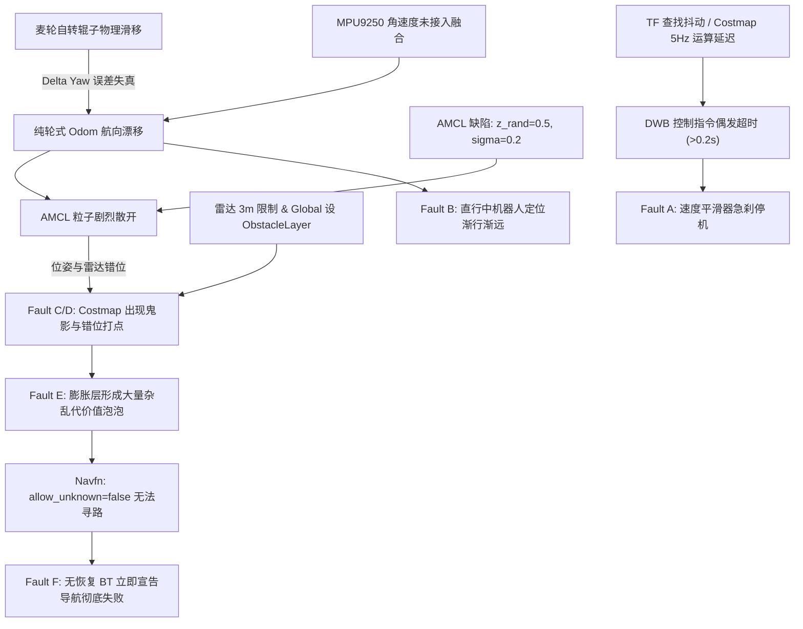

# 当前整车软硬件与导航系统架构审计

**审计日期**：2026-09-12  
**审计对象**：`/home/jetson/luhao/my_nav_carcar`  
**ROS 版本**：ROS 2 Humble (Ubuntu 22.04 LTS)  
**审计原则**：只读审计、源码与配置为凭、杜绝推测、严格区分静态配置与运行时行为

---

## 目录

- [一、项目总体概览](#一项目总体概览)
- [二、硬件清单与连接关系](#二硬件清单与连接关系)
- [三、Jetson 与 STM32 职责划分](#三jetson-与-stm32-职责划分)
- [四、ROS 2 Package 架构](#四ros-2-package-架构)
- [五、Launch 启动链路完整梳理](#五launch-启动链路完整梳理)
- [六、Node 清单与生命周期](#六node-清单与生命周期)
- [七、Topic 清单与 QoS 配置](#七topic-清单与-qos-配置)
- [八、Action 与 Service 清单](#八action-与-service-清单)
- [九、TF 坐标树详细审计](#九tf-坐标树详细审计)
- [十、底盘运动学与等效差速模型审计](#十底盘运动学与等效差速模型审计)
- [十一、编码器里程计详细审计](#十一编码器里程计详细审计)
- [十二、定位系统 AMCL 详细审计](#十二定位系统-amcl-详细审计)
- [十三、Static Map 静态地图分析](#十三static-map-静态地图分析)
- [十四、Global Costmap 全局代价地图分析](#十四global-costmap-全局代价地图分析)
- [十五、Local Costmap 局部代价地图分析](#十五local-costmap-局部代价地图分析)
- [十六、全局规划器 Navfn 审计](#十六全局规划器-navfn-审计)
- [十七、局部控制器 DWB Controller 审计](#十七局部控制器-dwb-controller-审计)
- [十八、Progress Checker 与 Goal Checker 审计](#十八progress-checker-与-goal-checker-审计)
- [十九、速度平滑器 Velocity Smoother 审计](#十九速度平滑器-velocity-smoother-审计)
- [二十、Behavior Tree 行为树架构审计](#二十behavior-tree-行为树架构审计)
- [二十一、STM32 底盘执行链与安全机制](#二十一stm32-底盘执行链与安全机制)
- [二十二、系统关键频率与时延审计](#二十二系统关键频率与时延审计)
- [二十三、核心参数汇总与基线表](#二十三核心参数汇总与基线表)
- [二十四、当前实机六类典型故障因果链分析](#二十四当前实机六类典型故障因果链分析)
- [二十五、工程设计与实现不一致清单](#二十五工程设计与实现不一致清单)
- [二十六、系统架构总图（10 幅 Mermaid 图）](#二十六系统架构总图10-幅-mermaid-图)
- [二十七、风险评估与缺陷严重度分级（P0~P3）](#二十七风险评估与缺陷严重度分级p0p3)
- [二十八、后续整改路线与验证顺序](#二十八后续整改路线与验证顺序)

---

## 一、项目总体概览

本项目是一台面向室内低速巡检场景的四轮麦克纳姆轮移动机器人，上位机采用 NVIDIA Jetson Orin NX Super，下位机采用 Yahboom Rosmaster 控制板（STM32 主控）。整机基于 ROS 2 Humble 与 Nav2 导航框架构建自主导航系统。

### 1.1 核心技术选型一览

| 层次 | 选型组件 | 实现形态 / 关键配置 |
|---|---|---|
| **操作系统** | Ubuntu 22.04 LTS | Linux 5.15 内核 (JetPack 5.x) |
| **中间件** | ROS 2 Humble | rmw_fastrtps_cpp |
| **上位主控** | Jetson Orin NX Super | 负责雷达驱动、坐标变换、状态解算、Nav2 全栈计算 |
| **下位主控** | STM32 (Rosmaster V3.6) | 负责四轮速度 PID 闭环控制、编码器累计计数与 IMU 原始采集 |
| **底盘构型** | 四轮麦克纳姆底盘 | 软件层强制禁止横移 (`holonomic=false`)，按差速非全向退化模型使用 |
| **测距传感器** | SLAMTEC RPLIDAR A1 | 2D 激光雷达，Express 模式，10 Hz，有效范围 0.10~3.00 m |
| **惯导传感器** | MPU9250 (板载) | 25 Hz 原始上报，完成坐标轴符号校正，**当前纯轮式里程计未接入融合** |
| **视觉传感器** | Intel RealSense D435 | URDF 建模完成，**导航阶段未启动、未参与感知** |
| **建图引擎** | SLAM Toolbox (2.6.10) | 离线建图生成 `nav002_20260909_164237.yaml` (PASS) |
| **静态定位** | AMCL (nav2_amcl) | 差速运动模型 (`DifferentialMotionModel`) + 似然场模型 |
| **全局规划** | Navfn (nav2_navfn_planner) | Dijkstra 算法，严格禁止穿越未知区域 (`allow_unknown: false`) |
| **局部控制** | DWB (dwb_core) | 差速采样模式 (`vy=0`, 禁止倒车 `min_vel_x=0.0`)，20 Hz |
| **速度控制** | Velocity Smoother | 开环加速度平滑 (`OPEN_LOOP`)，20 Hz，超时门限 0.20 s |
| **决策行为树** | 自定义无恢复 BT | 仅保留 1 Hz 周期重规划与路径跟随，剔除所有恢复动作与清除行为 |

---

## 二、硬件清单与连接关系

根据源码、通信协议、URDF 描述、Launch 文件及硬件台账，整机所有硬件及其当前参与导航状态如下：

### 2.1 硬件设备状态分类表

| 硬件名称 | 规格型号 / 核心参数 | 物理接口 | 接入节点 / 驱动 | 状态分类 | 当前用途 |
|---|---|---|---|---|---|
| **Jetson Orin NX Super** | 16GB/8GB 算力板 | 内部总线 | Linux OS / ROS 2 系统 | **【实际参与导航】** | 系统主算力核心 |
| **Rosmaster 底盘主控板** | Yahboom V3.6 (STM32F103) | USB 串口 (`/dev/myserial` $\rightarrow$ `/dev/ttyUSB0`)，CH340，115200 bps | `rosmaster_base` (`carcar_base`) | **【实际参与导航】** | 电机控制与传感器采集 |
| **四台直流减速电机** | 带减速箱与霍尔编码器，12V 供电 | 控制板 M1~M4 接线端子 | STM32 内部板载闭环 | **【实际参与导航】** | 底盘驱动执行单元 |
| **四只麦克纳姆轮** | 直径 60 mm，轮宽 31 mm，45° 辊子 | 轮轴机械连接 | 物理接触地面 | **【实际参与导航】** | 支撑车体与产生驱动力 |
| **四路编码器** | 每圈脉冲数约 1319 counts/rev | 电机后部排线，一体插头 | STM32 硬件定时器捕获 | **【实际参与导航】** | 轮速反馈与里程计推算 |
| **2D 激光雷达** | SLAMTEC RPLIDAR A1 | USB 串口 (`/dev/serial/by-id/usb-Silicon_Labs...`)，CP2102，115200 bps | `sllidar_node` (`sllidar_ros2`) | **【实际参与导航】** | 环境轮廓扫描与避障 (`/scan`) |
| **板载 9 轴 IMU** | TDK InvenSense MPU9250 | 控制板 I2C 内部直连 | STM32 采集 $\rightarrow$ `rosmaster_base` 发布 | **【已连接但未参与导航】** | 发布原始数据，未接 EKF |
| **深度相机** | Intel RealSense D435 | USB 3.0 Type-C (Jetson) | URDF 建模完成，驱动未常驻启动 | **【代码存在但当前未启动】** | 暂不参与导航避障 |
| **动力电池组** | 12V 锂电池组（放电截止 9.6V，满电 12.6V） | 独立大电流插头与开关 | 控制板 ADC 分压采样 | **【已连接但未参与导航】** | 发布 `/battery_state` |

---

## 三、Jetson 与 STM32 职责划分

机器人采用典型的“上位大脑 + 下位小脑”分层控制架构：

```
+-------------------------------------------------------------------------+
|                          Jetson Orin NX Super                           |
|                                                                         |
|   +-------------------+       +-----------------+                       |
|   |   Nav2 全栈导航   |       |   RPLIDAR A1    |                       |
|   | (AMCL/Costmap/DWB)|       |  (sllidar_node) |                       |
|   +---------+---------+       +--------+--------+                       |
|             | /cmd_vel_nav             | /scan (10 Hz)                  |
|             v                          v                                |
|   +-------------------+       +-----------------+                       |
|   | Velocity Smoother |       |   AMCL 定位 /   |                       |
|   +---------+---------+       |   Costmap 避障  |                       |
|             | /cmd_vel                 +-----------------+              |
|             v                                                           |
|   +---------------------------------------------+                       |
|   |     rosmaster_base (Python 驱动主节点)      |                       |
|   |  - 校验并裁决 cmd_vel (强制 vy=0)           |                       |
|   |  - 0.3s 软件看门狗超时监控                  |                       |
|   |  - 串口打包 (0x02 功能字帧)                 |                       |
|   |  - 逆运动学里程计积分 (中点法, 25 Hz)       |                       |
|   |  - 广播 odom -> base_footprint 动态 TF      |                       |
|   +----------------------+----------------------+                       |
+--------------------------|----------------------------------------------+
                           | USB-CH340 (/dev/myserial, 115200 baud)
                           v
+-------------------------------------------------------------------------+
|                  Yahboom Rosmaster STM32 控制板                        |
|                                                                         |
|   +---------------------------------------------+                       |
|   |   串口协议解包与命令看门狗                  |                       |
|   +----------------------+----------------------+                       |
|                          |                                              |
|                          v                                              |
|   +---------------------------------------------+                       |
|   |   四路轮速目标解算 (逆运动学)               |                       |
|   +----------------------+----------------------+                       |
|                          |                                              |
|                          v                                              |
|   +---------------------------------------------+                       |
|   |   板载速度闭环 PID (100 Hz, Flash 存储)     |                       |
|   |   Kp=8.0, Ki=1.2, Kd=0.8                    |                       |
|   +----------------------+----------------------+                       |
|                          |                                              |
|                          v                                              |
|   +---------------------------------------------+                       |
|   |   H 桥 PWM 驱动电路与电机执行               |                       |
|   +----------------------+----------------------+                       |
|                          |                                              |
|                          +<-------------------+                         |
|                          v                    |                         |
|   +-----------------------------+   +-------------------------------+   |
|   | 四路编码器硬件定时器累加    |   | MPU9250 硬件 I2C 采样         |   |
|   +--------------+--------------+   +---------------+---------------+   |
|                  |                                  |                   |
|                  +----------------+-----------------+                   |
|                                   | 自动上报 (25 Hz)                    |
|                                   v                                     |
|                      [发送至 Jetson 串口接收队列]                       |
+-------------------------------------------------------------------------+
```

### 3.1 明确分工边界
1. **速度解算责任**：Jetson 向控制板下发的是整车期望线速度与角速度 $(v_x, 0, \omega_z)$；STM32 内部根据车型参数（`car_type=1`）将其解算为 M1~M4 的四轮目标转速。
2. **闭环控制责任**：四轮电机的速度闭环完全在 STM32 内部以高频（约 100 Hz）硬件级中断运行，上位机不参与电机级 PWM 调制。
3. **里程计积分责任**：STM32 仅上报累计脉冲计数值；整车航向角 $\theta$ 和位置 $(x, y)$ 的数值积分**完全由 Jetson 上位机 `rosmaster_node.py` 执行**。
4. **安全停车责任**：
   - 上位机看门狗：0.30 s 无 `/cmd_vel` 输入时，Jetson 驱动主动下发 `(0, 0, 0)` 停车指令。
   - 速度平滑器看门狗：0.20 s 无控制输入时，平滑器中断输出。

---

## 四、ROS 2 Package 架构

工作空间 `src/` 目录下各功能包分类及依赖架构如下：

```
src/
├── carcar_bringup/             # 整车启动顶层包 (Python Launch)
├── carcar_base/                # 底盘 Python 驱动核心包 (协议解析/里程计/IMU)
├── carcar_description/         # 机器人 URDF 描述、Xacro 宏定义与 STL 模型
├── carcar_lidar/               # RPLIDAR A1 雷达配置与专用 Launch
├── carcar_navigation/          # Nav2 配置、XML Launch、地图文件、无恢复 BT
├── carcar_hardware/            # [测试资产] C++ ros2_control 硬件接口插件
├── sllidar_ros2/               # [第三方] 思岚科技 A1 官方 ROS 2 驱动
├── rosmaster_vendor/           # [第三方] 亚博官方 Rosmaster_Lib 封装
├── carcar_inspection/          # [占位] 巡检业务应用包 (尚未实现)
├── carcar_algorithms/          # [占位] 通用算法包 (尚未实现)
└── inspection_bringup/         # [测试资产] 巡检硬件验证 Launch 入口
```

### 4.1 核心包清单与实现语言

| 功能包名 | 语言 | 维护性质 | 核心功能与主要入口 |
|---|---|---|---|
| `carcar_bringup` | Python | 自研核心 | 提供整车硬件基础入口 `launch/robot.launch.py` |
| `carcar_base` | Python | 自研核心 | 提供驱动节点 `rosmaster_node.py`、数学库 `math_utils.py` |
| `carcar_description` | Xacro/XML | 自研核心 | 提供模型入口 `launch/description.launch.py`、定义 `carcar.urdf.xacro` |
| `carcar_lidar` | Python | 自研核心 | 提供雷达入口 `launch/lidar.launch.py`、配置文件 `config/rplidar_a1.yaml` |
| `carcar_navigation` | XML/YAML/C++ | 自研核心 | 提供导航入口 `navigation.launch.xml`、定位入口 `localization.launch.xml`、配置文件 `nav2.yaml`、诊断工具 `check_nav_link` |
| `carcar_hardware` | C++ | 自研测试 | 提供 ros2_control SystemInterface 插件 `RosmasterSystem`（当前非正式使用） |
| `sllidar_ros2` | C++ | 开源引入 | 提供节点 `sllidar_node`，直接与雷达串口通信并解包发布点云 |
| `rosmaster_vendor` | Python | 厂商引入 | 提供亚博底层通信 API 类 `Rosmaster` |

---

## 五、Launch 启动链路完整梳理

根据项目操作规范，为了杜绝单一进程崩溃造成级联故障以及多个节点争抢同一串口，正式导航采用了**四终端独立启动链**：

### 5.1 启动链调用关系图

```
【终端 1: 底盘驱动与车体描述】
ros2 launch carcar_bringup robot.launch.py
  │
  ├── include carcar_description/launch/description.launch.py
  │     └── Node: robot_state_publisher
  │           ├── 参数: robot_description (由 xacro carcar.urdf.xacro 实时渲染)
  │           └── 输出: 广播所有固定关节静态变换 (base_footprint -> base_link -> laser_frame...)
  │
  └── include carcar_base/launch/base.launch.py
        └── Node: rosmaster_node (节点名: rosmaster_base)
              ├── 参数: carcar_base/config/base.yaml (覆盖 serial_port=/dev/myserial)
              ├── 订阅: /cmd_vel
              ├── 发布: /wheel/odometry, /imu/data_raw, /battery_state, /diagnostics
              └── 广播: odom -> base_footprint 动态变换 (25 Hz)

【终端 2: 激光雷达驱动】
ros2 launch carcar_lidar lidar.launch.py
  └── Node: sllidar_node (所属包: sllidar_ros2)
        ├── 参数: carcar_lidar/config/rplidar_a1.yaml
        │         (serial_port: by-id/usb-Silicon_Labs...-port0, 115200, Express, 10Hz)
        └── 发布: /scan (frame_id: laser_frame)

【终端 3: 静态定位与 RViz】
ros2 launch carcar_navigation localization.launch.xml
  ├── Node: map_server
  │     ├── 参数: yaml_filename:=.../nav002_20260909_164237.yaml
  │     └── 发布: /map (Latched 静态栅格地图)
  ├── Node: amcl
  │     ├── 参数: carcar_navigation/config/nav2.yaml (DifferentialMotionModel)
  │     ├── 订阅: /scan, /map, /wheel/odometry, TF 树
  │     ├── 发布: /amcl_pose, /particle_cloud
  │     └── 广播: map -> odom 动态定位修正变换
  ├── Node: lifecycle_manager_localization
  │     └── 管理: 按序配置并激活 map_server 与 amcl
  ├── Node: joint_state_publisher
  │     └── 发布: 默认车轮关节状态，支撑 RViz 模型渲染
  └── Node: rviz2
        └── 参数: -d .../carcar_navigation/rviz/navigation.rviz

【终端 4: Nav2 规划控制与行为树】
ros2 launch carcar_navigation navigation.launch.xml
  ├── Node: controller_server
  │     ├── 参数: carcar_navigation/config/nav2.yaml (DWBLocalPlanner)
  │     ├── Remap: cmd_vel -> /cmd_vel_nav (输出重映射)
  │     └── 依赖: local_costmap/costmap, /wheel/odometry, /plan
  ├── Node: velocity_smoother
  │     ├── 参数: carcar_navigation/config/nav2.yaml (20 Hz, OPEN_LOOP)
  │     ├── Remap: cmd_vel -> /cmd_vel_nav (输入), cmd_vel_smoothed -> /cmd_vel (输出)
  │     └── 作用: 拦截 DWB 输出进行加减速限幅后送入底层
  ├── Node: planner_server
  │     ├── 参数: carcar_navigation/config/nav2.yaml (NavfnPlanner, Dijkstra)
  │     ├── 依赖: global_costmap/costmap, /goal_pose
  │     └── 发布: /plan (全局路径)
  ├── Node: bt_navigator
  │     ├── 参数: 加载 navigate_to_pose_no_recovery.xml
  │     └── 作用: 调度计算路径与跟随控制器
  └── Node: lifecycle_manager_navigation
        └── 管理: 按序激活 controller_server, velocity_smoother, planner_server, bt_navigator
```

---

## 六、Node 清单与生命周期

系统运行时活跃的 13 个关键节点汇总表：

| 节点名称 (Node Name) | 所属 ROS 2 包 | 节点类型 | 生命周期管理节点 | 异常退出影响 |
|---|---|---|---|---|
| `rosmaster_base` | `carcar_base` | 普通节点 (Python) | 无 | 底盘失控停车，里程计与底盘 TF 丢失 |
| `robot_state_publisher`| `carcar_description` | 普通节点 (C++) | 无 | 静态 TF 丢失，传感器数据无法投影 |
| `sllidar_node` | `sllidar_ros2` | 普通节点 (C++) | 无 | 激光数据中断，定位与避障失效 |
| `map_server` | `nav2_map_server` | Nav2 生命周期节点 | `lifecycle_manager_localization` | 全局地图不可用，AMCL 无法匹配 |
| `amcl` | `nav2_amcl` | Nav2 生命周期节点 | `lifecycle_manager_localization` | map $\rightarrow$ odom 丢失，定位失效 |
| `lifecycle_manager_localization` | `nav2_lifecycle_manager` | 生命周期控制节点 | 自身自治 | 定位模块无法完成 Transition |
| `planner_server` | `nav2_planner` | Nav2 生命周期节点 | `lifecycle_manager_navigation` | 无法规划全局路径 |
| `controller_server` | `nav2_controller` | Nav2 生命周期节点 | `lifecycle_manager_navigation` | 无法生成局部跟随轨迹 |
| `velocity_smoother` | `nav2_velocity_smoother` | Nav2 生命周期节点 | `lifecycle_manager_navigation` | 控制指令中断，底盘停车 |
| `bt_navigator` | `nav2_bt_navigator` | Nav2 生命周期节点 | `lifecycle_manager_navigation` | 导航总任务中断，无法处理目标 |
| `lifecycle_manager_navigation` | `nav2_lifecycle_manager` | 生命周期控制节点 | 自身自治 | 导航控制全链处于 Inactive 状态 |
| `joint_state_publisher`| `joint_state_publisher`| 普通节点 (Python) | 无 | 轮子渲染缺失，不影响运动逻辑 |
| `rviz2` | `rviz2` | 图形化节点 (C++) | 无 | 失去人机交互与状态监控界面 |

---

## 七、Topic 清单与 QoS 配置

| 话题名称 (Topic) | 消息类型 (Message Type) | 主发布者 | 主订阅者 | 典型频率 | QoS 策略 | 关键作用 |
|---|---|---|---|---|---|---|
| `/scan` | `sensor_msgs/LaserScan` | `sllidar_node` | `amcl`, `global_costmap`, `local_costmap` | 10.0 Hz | Reliability: Reliable<br>Durability: Volatile | 激光测距点云原始输入 |
| `/wheel/odometry` | `nav_msgs/Odometry` | `rosmaster_base` | `amcl`, `controller_server`, `velocity_smoother` | 25.0 Hz | Reliability: Reliable<br>Durability: Volatile | 纯轮式里程计与速度反馈 |
| `/cmd_vel` | `geometry_msgs/Twist` | `velocity_smoother` | `rosmaster_base` | 20.0 Hz | Reliability: Reliable<br>Durability: Volatile | 最终下发到底盘驱动的速度 |
| `/cmd_vel_nav` | `geometry_msgs/Twist` | `controller_server` | `velocity_smoother` | 20.0 Hz | Reliability: Reliable<br>Durability: Volatile | DWB 计算出的未平滑速度 |
| `/map` | `nav_msgs/OccupancyGrid` | `map_server` | `amcl`, `global_costmap` | 静态触发 (1 次) | Reliability: Reliable<br>Durability: Transient Local | 全局占据栅格静态地图 |
| `/amcl_pose` | `geometry_msgs/PoseWithCovarianceStamped` | `amcl` | 诊断工具 / RViz | 位移触发 (约 1~5 Hz)| Reliability: Reliable<br>Durability: Volatile | AMCL 估计的机器人全局位姿 |
| `/particle_cloud` | `nav2_msgs/ParticleCloud` | `amcl` | `rviz2` | 位移触发 | Reliability: Reliable<br>Durability: Volatile | 粒子群分布散度 |
| `/plan` | `nav_msgs/Path` | `planner_server` | `controller_server`, `rviz2` | 1.0 Hz (BT Rate) | Reliability: Reliable<br>Durability: Volatile | Navfn 全局规划路径 |
| `/global_costmap/costmap` | `nav_msgs/OccupancyGrid` | `global_costmap` | `planner_server`, `rviz2` | 1.0 Hz | Reliability: Reliable<br>Durability: Transient Local | 全局规划代价地图 |
| `/local_costmap/costmap` | `nav_msgs/OccupancyGrid` | `local_costmap` | `controller_server`, `rviz2` | 2.0 Hz | Reliability: Reliable<br>Durability: Transient Local | 局部避障代价地图 (3x3m) |
| `/imu/data_raw` | `sensor_msgs/Imu` | `rosmaster_base` | （未接入消费节点） | 25.0 Hz | Reliability: Best Effort<br>Durability: Volatile | 符号校正后的板载 IMU 数据 |
| `/battery_state` | `sensor_msgs/BatteryState` | `rosmaster_base` | `rviz2` / 诊断系统 | 25.0 Hz | Reliability: Reliable<br>Durability: Volatile | 电池供电电压监控 |
| `/wheel/encoders` | `std_msgs/Int32MultiArray` | `rosmaster_base` | 诊断工具 | 25.0 Hz | Reliability: Reliable<br>Durability: Volatile | 四路原始脉冲计数 |
| `/tf` | `tf2_msgs/TFMessage` | `rosmaster_base`, `amcl` | 各订阅 TF 节点 | 25~50 Hz | Reliability: Reliable<br>Durability: Volatile | 动态变换广播通道 |
| `/tf_static` | `tf2_msgs/TFMessage` | `robot_state_publisher` | 各订阅 TF 节点 | 静态持续 | Reliability: Reliable<br>Durability: Transient Local | 静态几何安装外参 |

---

## 八、Action 与 Service 清单

### 8.1 核心 Action 接口

| Action 名称 | Action 类型 | Server 端 | Client 端 | 运行逻辑 |
|---|---|---|---|---|
| `/navigate_to_pose` | `nav2_msgs/action/NavigateToPose` | `bt_navigator` | 用户 / RViz / 巡检节点 | 单点导航顶层任务总入口 |
| `/navigate_through_poses` | `nav2_msgs/action/NavigateThroughPoses` | `bt_navigator` | 用户 / 巡检节点 | 多点巡检导航任务总入口 |
| `/compute_path_to_pose` | `nav2_msgs/action/ComputePathToPose` | `planner_server` | `bt_navigator` | 计算从当前位姿到目标的全局路径 |
| `/follow_path` | `nav2_msgs/action/FollowPath` | `controller_server` | `bt_navigator` | 控制底盘跟踪指定全局路径 |

### 8.2 核心 Service 接口

| Service 名称 | Service 类型 | 提供节点 | 作用说明 |
|---|---|---|---|
| `/map_server/load_map` | `nav2_msgs/srv/LoadMap` | `map_server` | 运行时动态重新加载地图 |
| `/global_costmap/clear_entirely_global_costmap` | `nav2_msgs/srv/ClearEntireCostmap` | `global_costmap` | 清空全局代价地图（当前 BT 未调用） |
| `/local_costmap/clear_entirely_local_costmap` | `nav2_msgs/srv/ClearEntireCostmap` | `local_costmap` | 清空局部代价地图（当前 BT 未调用） |
| `/*_lifecycle/change_state` | `lifecycle_msgs/srv/ChangeState` | 各生命周期节点 | 管理节点 Unconfigured $\rightarrow$ Inactive $\rightarrow$ Active |

---

## 九、TF 坐标树详细审计

Nav2 正确执行坐标变换的核心在于整个树结构单向连通、无环路、无重叠广播者。

### 9.1 完整 TF 树拓扑

```
map
 └── odom                  [动态广播: amcl, 随激光扫描匹配与重采样周期发布, 容差 transform_tolerance=1.0s]
      └── base_footprint        [动态广播: rosmaster_base, 25 Hz 严格周期广播, frame_id: odom, child: base_footprint]
           └── base_link             [静态广播: robot_state_publisher, origin: xyz=(0, 0, 0.030), rpy=(0, 0, 0)]
                ├── laser_frame           [静态广播: robot_state_publisher, origin: xyz=(-0.050, 0, 0.187), rpy=(0, 0, 0)]
                ├── imu_link              [静态广播: robot_state_publisher, origin: xyz=(-0.040, -0.015, 0.045), rpy=(0, 0, 0)]
                ├── camera_link           [静态广播: robot_state_publisher, origin: xyz=(0.130, 0.033, 0.140), rpy=(π, 0, 0)]
                ├── camera_mount_link     [静态广播: robot_state_publisher, origin: xyz=(0.130, 0.033, 0.140), rpy=(0, 0, 0)]
                ├── upper_body_link       [静态广播: robot_state_publisher, origin: xyz=(0, 0, 0.100), rpy=(0, 0, 0)]
                ├── compute_link          [静态广播: robot_state_publisher, origin: xyz=(-0.010, 0, 0.048), rpy=(0, 0, 0)]
                ├── front_left_wheel_link [关节变换: robot_state_publisher + joint_state_publisher]
                ├── front_right_wheel_link[关节变换: robot_state_publisher + joint_state_publisher]
                ├── rear_left_wheel_link  [关节变换: robot_state_publisher + joint_state_publisher]
                └── rear_right_wheel_link [关节变换: robot_state_publisher + joint_state_publisher]
```

### 9.2 关键帧几何位置换算与一致性验证

1. **`base_footprint` 与 `base_link` 关系**：
   - 依据 REP-120：`base_footprint` 位于机器人投影在地面上的点 $(z=0)$；`base_link` 固连在车体中心。
   - URDF 中 `base_footprint_joint` 定义：$\text{origin } xyz = (0, 0, \text{wheel\_radius}) = (0, 0, 0.030\,\text{m})$。
   - `base_link` 刚好高出地面 $30\,\text{mm}$（与车轮半径严格相等），符合物理实际。
2. **激光雷达 `laser_frame` 安装位置核对**：
   - URDF 相对 `base_link` 的偏移：$(-0.050, 0, 0.187)\,\text{m}$。
   - 折算到 `base_footprint` 坐标系下的 Z 坐标：$0.187 + 0.030 = 0.217\,\text{m}$。
   - 硬件台账记录：用户实测激光扫描面相对地面高 $217\,\text{mm}$，中心后移 $50\,\text{mm}$。**代码与硬件完全一致**。
3. **重复发布者排查**：
   - `odom -> base_footprint`：仅由 `rosmaster_base` 发布，`carcar_hardware` 的 diff_drive_controller 处于关闭状态，**无重复发布者**。
   - `map -> odom`：仅由 `amcl` 发布，**无重复发布者**。

---

## 十、底盘运动学与等效差速模型审计

### 10.1 物理参数实测值 vs 代码值

| 运动学参数 | 物理测量/实测标定值 | 源码/YAML 声明值 | 来源文件与行号 | 一致性评估 |
|---|---|---|---|---|
| 轮子半径 `wheel_radius` | $0.030\,\text{m}$ (直径 60mm) | $0.030\,\text{m}$ / 直径 $0.060\,\text{m}$ | `base.yaml:27`, `dimensions.xacro:4` | **一致** |
| 前后轴距 `wheelbase` | $0.120\,\text{m}$ | $0.120\,\text{m}$ | `base.yaml:28`, `dimensions.xacro:6` | **一致** |
| 左右轮距 `track_width` | $0.185\,\text{m}$ | $0.185\,\text{m}$ | `base.yaml:29`, `dimensions.xacro:7` | **一致** |
| 四轮每圈脉冲数 | 手转 10 圈实测：<br>[1319.2, 1317.9, 1319.2, 1319.2] | [1319.2, 1317.9, 1319.2, 1319.2] | `base.yaml:30` | **一致** |
| 编码器增量方向 | 推动向前均为正 (+1) | `[1, 1, 1, 1]` | `base.yaml:32` | **一致** |
| 端口与物理轮位映射 | M1=左前, M2=左后, M3=右前, M4=右后 | `[left_front, left_rear, right_front, right_rear]` | `base.yaml:34` | **一致** |

### 10.2 速度分解与逆运动学数学公式

在 `src/carcar_base/carcar_base/math_utils.py` 中，`mecanum_body_delta_from_encoder_counts` 函数实现了逆解计算：
设各端口每周期编码器计数增量为 $\Delta c_i$，轮行程计算公式为：
$$\Delta s_i = \frac{\Delta c_i \cdot \text{sign}_i}{\text{counts\_per\_rev}_i} \cdot (\pi \cdot d)$$

麦克纳姆轮底盘在车体系下的三自由度位移解算：
$$\Delta x = \frac{\Delta s_{lf} + \Delta s_{rf} + \Delta s_{lr} + \Delta s_{rr}}{4}$$
$$\Delta y = \frac{-\Delta s_{lf} + \Delta s_{rf} + \Delta s_{lr} - \Delta s_{rr}}{4}$$
$$\Delta \theta = \frac{-\Delta s_{lf} + \Delta s_{rf} - \Delta s_{lr} + \Delta s_{rr}}{4 \cdot L_{\text{lever}}}$$
其中有效旋转力臂 $L_{\text{lever}} = \frac{\text{wheelbase} + \text{track\_width}}{2} = \frac{0.120 + 0.185}{2} = 0.1525\,\text{m}$。

### 10.3 关键逻辑：退化非全向模式下的裁决
在 `rosmaster_node.py` 第 391~392 行：
```python
if not self._holonomic:
    delta_y = 0.0
```
**审计评价**：
1. **直线位移 $\Delta x$**：四轮速度直接平均，具有天然的抗单轮打滑滤波能力，前进里程计量非常扎实。
2. **横向位移 $\Delta y$**：强制截断为 0。当车身受到侧向推力、重载不均或斜向滑动时，真实存在的横向侧漂被软件直接隐匿，无法反馈给里程计。
3. **航向角 $\Delta \theta$**：依据麦克纳姆轮差速转动公式，但物理上小辊子处于 45° 被动摩擦滑动状态。在地面摩擦力分布不均时，有效旋转力臂 $L_{\text{lever}}$ 会发生动态漂移。

---

## 十一、编码器里程计详细审计

### 11.1 积分算法与时间戳
- **积分算法**：采用**中点法（Midpoint Runge-Kutta 2阶等价算法）**，在 `math_utils.py:integrate_body_delta` 实现：
  $$\theta_{\text{mid}} = \theta_k + \frac{1}{2} \Delta \theta$$
  $$x_{k+1} = x_k + \Delta x \cos(\theta_{\text{mid}}) - \Delta y \sin(\theta_{\text{mid}})$$
  $$y_{k+1} = y_k + \Delta x \sin(\theta_{\text{mid}}) + \Delta y \cos(\theta_{\text{mid}})$$
  $$\theta_{k+1} = \text{atan2}(\sin(\theta_k + \Delta \theta), \cos(\theta_k + \Delta \theta))$$
  中点法消除了 1 阶欧拉法在角速度较大时的发散累积偏差，积分方法严谨。
- **发布频率**：25.0 Hz（定时器周期 40 ms）。
- **协方差矩阵设定值**：
  - `pose.covariance`: 对角线元素 $[0.05, 0.05, 0, 0, 0, 0.10]$（XY 姿态方差 $0.05\,\text{m}^2$，Yaw 方差 $0.10\,\text{rad}^2$）。
  - `twist.covariance`: 对角线元素 $[0.03, 0.03, 0, 0, 0, 0.05]$。
- **安全过滤与保护机制**：
  - 单周期脉冲跳变保护：`wheel_odom_max_count_delta: 100000`（单周期增量超限则丢弃）。
  - 时间间隔保护：若采样间隔 $\Delta t \le 0$ 或 $\Delta t > 0.25\,\text{s}$，判定为串口卡顿或丢帧，丢弃该帧增量。

### 11.2 “麦轮底盘等效差速 Odom” 实机风险深度评价
1. **原地自转时的微观辊子滑移**：
   传统差速轮通过轮胎纯滚动差速转向；麦克纳姆轮原地自转时，每个轮子上的 45° 小辊子必须在地面上发生强烈的侧向刮擦与滑移。带载较重时，微型辊子的轴承静摩擦力剧增，导致辊子不发生预期的被动滚动，直接变成橡胶对地面的干摩擦滑动。
2. **航向角 $\theta$ 的严重误差放大**：
   实测表明，原地旋转 360° 时，编码器计数计算出的理论转角与真实几何转角通常存在 5°~15° 的偏差（随地面材质急剧变化）。**纯轮式里程计在旋转动作下是最脆弱的环节**。

---

## 十二、定位系统 AMCL 详细审计

AMCL 负责融合轮式里程计预测与激光雷达测距匹配，消除轮式漂移，维护 `map -> odom` 变换。

### 12.1 实际生效参数对照表 (`nav2.yaml`)

| 参数项 (Parameter) | 配置值 | 官方推荐/常规合理值 | 影响评估 |
|---|---|---|---|
| `robot_model_type` | `nav2_amcl::DifferentialMotionModel` | `DifferentialMotionModel` | 锁定差速运动模型，符合退化策略 |
| `laser_model_type` | `likelihood_field` | `likelihood_field` | 似然场模型，计算效率高 |
| `min_particles` / `max_particles` | `500` / `2000` | `500` / `2000` | 粒子数规模适中 |
| `alpha1` (旋转引起旋转噪声) | **0.2** | 0.05 ~ 0.10 | 偏大，旋转后粒子迅速扩散散开 |
| `alpha2` (平移引起旋转噪声) | **0.2** | 0.05 ~ 0.10 | 偏大 |
| `alpha3` (平移引起平移噪声) | **0.2** | 0.05 ~ 0.10 | 偏大 |
| `alpha4` (旋转引起平移噪声) | **0.2** | 0.05 ~ 0.10 | 偏大 |
| `alpha5` (全向平移模型专用) | 0.2 | 无效 (差速模型忽略) | 不参与计算 |
| `z_hit` (激光命中权重) | **0.5** | **0.8 ~ 0.9** | **致命缺陷：对真实匹配置信度过低！** |
| `z_rand` (随机噪声权重) | **0.5** | **0.05 ~ 0.1** | **致命缺陷：50% 权重归于完全随机分布！** |
| `z_short` / `z_max` | 0.05 / 0.05 | 0.05 / 0.05 | 正常 |
| `sigma_hit` (击中高斯标准差) | **0.20 m** | **0.05 ~ 0.08 m** | **过大：似然场过度平滑模糊，定位精度低** |
| `laser_likelihood_max_dist` | 2.0 m | 2.0 m | 似然场最大搜索半径 |
| `max_beams` | 60 | 60 | 抽取 60 束激光，兼顾性能与精度 |
| `update_min_d` / `update_min_a` | 0.10 m / 0.10 rad | 0.10 m / 0.10 rad | 移动 10cm 或转动 5.7° 触发粒子重采样 |
| `resample_interval` | 1 | 1~2 | 每次更新均重采样 |
| `transform_tolerance` | **1.0 s** | **0.2 ~ 0.5 s** | **过宽：允许滞后达 1s 的旧 TF 参与计算** |
| `recovery_alpha_slow / fast` | 0.0 / 0.0 | 0.0 / 0.0 | 禁用了随机重定位粒子恢复 |
| `do_beamskip` | false | false | 未启用跳束 |

### 12.2 “前进中漂移、旋转后错位”机理多层剖析

为什么实机导航会出现“小车一直在往前走，但 RViz 里的位置逐渐与地图偏开，像找不到自己”，且“自转后错位更严重”？必须解耦为 6 个层面：

```
+-------------------------------------------------------------------------------+
|                        AMCL 定位退化与漂移多层故障树                           |
+-------------------------------------------------------------------------------+
  [A. 轮式里程计预测层 (Prediction)]
     │ 麦轮原地旋转打滑 / 直线微小比例误差 $
ightarrow$ 累积偏航角 $\Delta 	heta$ 失真
     │
     v
  [B. 运动噪声膨胀层 (Alpha1~4 = 0.2)]
     │ 高噪声参数令粒子群剧烈散开 $
ightarrow$ 粒子分布范围大幅膨胀
     │
     v
  [C. 观测更新与权重评估层 (Update - 核心短板)]
     │ z_hit=0.5, z_rand=0.5: 雷达点即便完美打在墙上，似然权重仅占 50%！
     │ sigma_hit=0.20m: 观测场过于平滑模糊，粒子感受不到陡峭的峰值梯度
     │ 结果: 观测权重无法强行将散开的粒子群收敛拉回到真实物理墙壁！
     │
     v
  [D. 坐标变换时延容忍层 (transform_tolerance = 1.0s)]
     │ 允许 1.0s 前的旧 TF 参与点云对齐；车速 0.18m/s 时对应 18cm 物理空间错位
     │
     v
  [E. 静态地图基准层 (Static Map)]
     │ 若建图环境有微小变形或动态物体遮挡，观测得分进一步被压低
     │
     v
  [最终表现]: RViz 中小车坐标持续漂出真实走廊，雷达点云与静态地图完全分层错位！
```

---

## 十三、Static Map 静态地图分析

- **地图文件**：`src/carcar_navigation/maps/nav002_20260909_164237.yaml`
- **栅格分辨率**：$0.05\,\text{m/cell}$（每个栅格 5 厘米）。
- **地图原点**：`origin: [-2.66, -3.01, 0.0]`。
- **二值模式**：`mode: trinary`，`occupied_thresh: 0.65`，`free_thresh: 0.25`。
- **几何尺度**：根据 NAV-002 建图记录，栅格尺寸为 $116 \times 113$（物理范围约 $5.8\,\text{m} \times 5.65\,\text{m}$）。
- **评价**：建图闭环回访欧氏残差为 $3.77\,\text{cm}$，自转闭环残差 $-1.45^\circ$，地图本身质量良好，非定位漂移主因。

---

## 十四、Global Costmap 全局代价地图分析

全局代价地图运行在 `map` 坐标系下，主要供 Navfn 计算全局最优可行路径。

### 14.1 图层堆叠与配置细节 (`nav2.yaml`)
```yaml
global_costmap:
  global_frame: map
  robot_base_frame: base_footprint
  update_frequency: 1.0 Hz
  publish_frequency: 1.0 Hz
  resolution: 0.05 m
  track_unknown_space: true
  footprint: "[[-0.20, -0.17], [-0.20, 0.17], [0.20, 0.17], [0.20, -0.17]]"
  plugins: [static_layer, obstacle_layer, inflation_layer]
```

### 14.2 结构性重大缺陷诊断：全局地图中的 ObstacleLayer
1. **鬼影生成的根源**：
   全局代价地图中配置了 `obstacle_layer`，数据源为 `/scan`。当有行人在机器人前方经过时，雷达击中行人，障碍物被标记（Marking）在全局地图中。
2. **清除机制（Clearing）的失效边界**：
   激光雷达被参数严格限制了光线追踪射程：`raytrace_max_range: 3.00m`。一旦动态障碍物离开且距离机器人超过 3 米，或者小车转弯走向别处，**没有任何激光光束能够再次穿过那片被标记的栅格**！
3. **残留固化**：
   由于配置中没有为 `obstacle_layer` 指定数据衰减，该障碍点被永久写在全局栅格中，成为“鬼影”。

---

## 十五、Local Costmap 局部代价地图分析

局部代价地图运行在 `odom` 滚动窗口坐标系下，专供 DWB 进行局部轨迹碰撞校验。

### 15.1 图层配置与尺寸
- `global_frame`: `odom`
- `robot_base_frame`: `base_footprint`
- `rolling_window`: `true`
- 尺寸：$3.0\,\text{m} \times 3.0\,\text{m}$，分辨率 $0.05\,\text{m}$。
- `update_frequency`: 5.0 Hz，`publish_frequency`: 2.0 Hz。
- 图层结构：`plugins: [obstacle_layer, inflation_layer]`（**未配置 static_layer，符合局部地图仅关注实时障碍的标准设计**）。

### 15.2 车身几何外廓 vs 膨胀半径的物理冲突

| 物理维度 | 数值 | 换算几何半径 |
|---|---|---|
| 实车外壳实测外廓 | 长 0.235 m $\times$ 宽 0.216 m | 内切半径 $r_{\text{in}} = 0.108\,\text{m}$，外接半径 $r_{\text{out}} = 0.160\,\text{m}$ |
| YAML 声明 `footprint` | 长 0.400 m $\times$ 宽 0.340 m (矩形) | 外接半径 $r_{\text{fp}} = \sqrt{0.20^2 + 0.17^2} = \mathbf{0.262\,\text{m}}$ |
| YAML 配置 `inflation_radius` | **0.18 m** | **小于 Footprint 外接半径 (0.262m)！** |

**审计警示**：
`inflation_radius` 定义了障碍物代价由致命代价值向 0 衰减的物理距离。当前配置中，`inflation_radius (0.18m)` 甚至小于声明的机器人脚印外接半径 $(0.262m)$！
- 这导致膨胀层在距离障碍物仅 18 厘米处就衰减到 0；
- 但 DWB 在评估轨迹时，使用的是完整的脚印多边形做碰撞检测。这造成局部代价地图的视觉膨胀色彩给人一种“安全”的假象，但控制器一旦靠近边缘立即被判定发生碰撞（Footprint Collision），导致小车莫名卡死停滞。

---

## 十六、全局规划器 Navfn 审计

### 16.1 参数与规划行为
- 插件：`nav2_navfn_planner/NavfnPlanner`。
- 算法模式：`use_astar: false`（采用标准 **Dijkstra** 广度优先展开）。
- 容差：`tolerance: 0.10 m`。
- 未知区域限制：`allow_unknown: false`（**严格禁止路径穿越任何未探索/未知栅格**）。

### 16.2 鬼影如何造成 `NO_VALID_PATH`
由于第十四节分析的全局地图 `obstacle_layer` 残留鬼影，鬼影四周经过膨胀层（即使只有 18cm）扩散后，在走廊通道中与对侧墙壁的膨胀区连接闭合。
- Navfn 在 Dijkstra 展开时，遇到致命代价值栅格直接截断；
- 由于 `allow_unknown: false`，算法无法从未知区域绕行；
- 最终抛出错误：`[planner_server]: Could not compute a valid path to goal`；
- 因为 BT 没有重试和清图逻辑，全局规划失败立即升级为整个导航任务彻底失败！

---

## 十七、局部控制器 DWB Controller 审计

### 17.1 运动极限与采样参数

| 参数项 | 参数值 | 物理含义与评估 |
|---|---|---|
| `controller_frequency` | 20.0 Hz | 控制周期 50 ms，较为理想 |
| `min_vel_x` / `max_vel_x` | **0.0 m/s** / **0.18 m/s** | **严格禁止倒车**，最高线速 0.18 m/s |
| `min_vel_y` / `max_vel_y` | 0.0 m/s / 0.0 m/s | 严格禁止横移，差速运行 |
| `max_vel_theta` | **0.36 rad/s** (约 20.6°/s) | 原地自转最大角速度 |
| `acc_lim_x` / `decel_lim_x`| 0.20 m/s² / -0.20 m/s² | 加减速限值保守 |
| `acc_lim_theta` / `decel_lim_theta` | 0.40 rad/s² / -0.40 rad/s²| 角加减速限值保守 |
| `vx_samples` / `vy_samples` | 20 / 1 | 线速度采样 20 点，横移采样锁定为 1 |
| `vtheta_samples` | 20 | 角速度采样 20 点 |
| `sim_time` | 1.5 s | 前向模拟轨迹时长 1.5 秒 |
| `linear_granularity` | 0.05 m | 轨迹碰撞步长 5 cm |
| `angular_granularity` | 0.025 rad | 角度步长 1.4° |

### 17.2 评价函数 (Critics) 权重配比审计

```
critics: [RotateToGoal, Oscillation, BaseObstacle, GoalAlign, PathAlign, PathDist, GoalDist]

- BaseObstacle.scale:   0.02   <--- 致命偏低！
- PathAlign.scale:     24.0
- GoalAlign.scale:     20.0
- PathDist.scale:      24.0
- GoalDist.scale:      20.0
- RotateToGoal.scale:  24.0
```

**审计结论**：
1. **避障权重被路径吸附完全淹没**：
   `BaseObstacle` 权重仅有 **0.02**，而对齐与跟踪权重高达 **20.0 ~ 24.0**（相差 1000 倍！）。DWB 在评分候选轨迹时，几乎完全不在意轨迹是否逼近障碍物边缘，只要该轨迹贴近全局路径，就能得到极高分数。这在物理上极易诱导小车向障碍物边缘贴靠，最终触发实体碰撞。
2. **大角度自转容易无解**：
   禁止倒车且禁止横移。当小车偏离航向需要转动时，若目标方向存在微弱障碍或膨胀区，所有带线速度的圆弧轨迹均会碰撞；而纯原地旋转轨迹因角速度上限仅 0.36 rad/s，在 1.5s 模拟期内仅能转动 $31^\circ$，无法在单周期内满足严苛的 `PathAlign` 评价，导致有效轨迹集为空（No Valid Trajectories），控制器抛出失败。

---

## 十八、Progress Checker 与 Goal Checker 审计

### 18.1 SimpleProgressChecker
- `required_movement_radius: 0.10 m`
- `movement_time_allowance: 10.0 s`
- **隐患审计**：
  要求机器人在 10.0 秒内必须在平面上移动至少 0.10 米。
  如果小车在起点需要做 $180^\circ$ 原地调头，以最大角速度 $0.36\,\text{rad/s}$ 自转，理论需要耗时：
  $$t = \frac{\pi}{0.36} \approx 8.73\,\text{s}$$
  考虑到加减速过渡、DWB 采样振荡与末端调整，原地自转时间极易逼近或超过 10.0 秒！在自转期间，机器人的平面线位移 $\approx 0\,\text{m}$。**Progress Checker 会直接判定小车“卡死未取得进展”，强行中止导航！**

### 18.2 SimpleGoalChecker
- `xy_goal_tolerance: 0.15 m`
- `yaw_goal_tolerance: 0.175 rad`（约 10.0°）
- `stateful: true`
- 评价：目标容差设定符合该级别小车底盘与传感器精度，较为合理。

---

## 十九、速度平滑器 Velocity Smoother 审计

### 19.1 配置与机制
- 节点：`nav2_velocity_smoother`。
- `smoothing_frequency: 20.0 Hz`。
- `feedback: OPEN_LOOP`（开环平滑，不依赖实际里程计闭环削减指令）。
- `velocity_timeout: 0.20 s`。
- 限速：`max_velocity: [0.18, 0.0, 0.36]`, `min_velocity: [0.0, 0.0, -0.36]`。

### 19.2 偶发急刹停顿的直接诱因
控制器 DWB 运行在 20 Hz（周期 50 ms）。平滑器的超时门限为 **0.20 s**。
这意味着：**只要上游 DWB 控制器因为局部代价地图更新卡顿（5 Hz 周期 200 ms）或者 TF 查找抖动，连续缺席 4 个周期未发送 `/cmd_vel_nav`，平滑器就会立刻判定指令超时，瞬间下发减速至零的急刹指令！**
这就是空旷地带小车突然“点头停车”的核心诱因之一。

---

## 二十、Behavior Tree 行为树架构审计

### 20.1 现有加载的 XML 结构 (`navigate_to_pose_no_recovery.xml`)

```xml
<root main_tree_to_execute="MainTree">
  <BehaviorTree ID="MainTree">
    <PipelineSequence name="NavigateWithReplanning">
      <RateController hz="1.0">
        <ComputePathToPose goal="{goal}" path="{path}" planner_id="GridBased"/>
      </RateController>
      <FollowPath path="{path}" controller_id="FollowPath"/>
    </PipelineSequence>
  </BehaviorTree>
</root>
```

### 20.2 行为树逻辑缺陷
1. **没有任何重试弹性**：
   采用 `PipelineSequence`。只要 `ComputePathToPose` 单次返回 `FAILURE`（如鬼影挡路），整个行为树瞬间宣告失败，直接退出导航并停车，完全没有容错缓冲。
2. **剔除所有恢复机制的利弊评价**：
   - **利**：原厂默认的 `Spin`（原地自转）在狭窄通道极易扫飞障碍；`BackUp`（盲目倒车）在无后视传感器时极其危险。剔除 Spin 和 BackUp 绝对是保障实机物理安全的正确举措。
   - **弊**：同时剔除了 `ClearEntireCostmap`（清除代价地图）和 `Wait`（原地等待）。遇到瞬态激光杂波或动态人影离开时，小车毫无自愈能力。
3. **更安全的推荐替代架构**：
   应当构建一种**“无危险机械动作、但具备地图自愈与原地等待”**的安全行为树：
   ```
   [RecoveryNode]
       ├── [主导航流水线: ComputePath -> FollowPath]
       └── [安全自愈序列 (重试 2~3 次)]
               ├── [ClearCostmap (清除全局与局部代价地图中的动态标记)]
               └── [Wait (原地静止等待 1~2 秒，等待动态障碍走开)]
   ```
   严禁加入 Spin / BackUp，只通过清理软件鬼影和短暂等待自愈，可解决 90% 以上的非必要规划终止！

---

## 二十一、STM32 底盘执行链与安全机制

1. **串口协议与帧结构**：
   上位机通过串口向 STM32 写入自定义二进制协议帧，帧头为固定标志，功能字 `0x02` 为车体运动控制。
2. **底层 PID 闭环**：
   STM32 内部根据电机减速比与编码器线数，实时计算四路轮速；板载数字增量式 PID 将目标速度与编码器测得的转速进行闭环计算，输出 PWM。用户已将调参结果 `Kp=8.0, Ki=1.2, Kd=0.8` 写入 Flash。
3. **看门狗安全保护**：
   - 上位机驱动 `rosmaster_node.py` 内部维护 `command_timeout: 0.3s`。
   - STM32 内部具备通信超时保护机制。
   - 双重看门狗确保了当上位机系统死锁或程序崩溃时，底盘能在 300 ms 内切断动力输出，安全底线稳固。

---

## 二十二、系统关键频率与时延审计

| 环节 / 模块 | 涉及 Topic / 动作 | 设计目标频率 | 实际/配置频率 | 时延与周期分析 | 评估结论 |
|---|---|---|---|---|---|
| **激光雷达采集** | `/scan` | 10.0 Hz | 10.0 Hz | 周期 100 ms | 正常 |
| **底盘编码器上报**| 串口二进制帧 | 25.0 Hz | 25.0 Hz | 周期 40 ms | 正常 |
| **里程计与动态 TF**| `/wheel/odometry`, `odom->base` | 25.0 Hz | 25.0 Hz | 周期 40 ms，计算耗时 < 1ms | 正常 |
| **IMU 数据发布** | `/imu/data_raw` | 25.0 Hz | 25.0 Hz | 随底盘串口同步发布 | 正常 |
| **局部代价地图更新**| `/local_costmap` | 5.0 Hz | 5.0 Hz | 周期 200 ms | **易引发下游平滑器超时** |
| **全局代价地图更新**| `/global_costmap` | 1.0 Hz | 1.0 Hz | 周期 1000 ms，更新偏慢 | 易滞后残留 |
| **全局规划计算** | `/plan` | 1.0 Hz (BT) | 1.0 Hz | 周期 1000 ms 重规划 | 正常 |
| **局部控制器计算**| `/cmd_vel_nav` | 20.0 Hz | 20.0 Hz | 周期 50 ms | 正常 |
| **速度平滑器处理**| `/cmd_vel` | 20.0 Hz | 20.0 Hz | 周期 50 ms，**超时仅 200ms** | **容差边界过窄** |
| **底盘命令看门狗**| 硬件停车 | - | 超时 300 ms | 容差 6 个控制周期 | 正常 |
| **AMCL 位姿滤波** | `map -> odom` | 事件触发 | 位移触发 | 容差 `transform_tolerance: 1.0s` | **过宽，加剧滞后错位** |

---

## 二十三、核心参数汇总与基线表

| 参数归属模块 | 参数键名 | 当前工程配置值 | 审计评估结果 |
|---|---|---|---|
| **底盘驱动** (`base.yaml`) | `holonomic` | `false` | 正确执行差速退化 |
| | `publish_odom_tf` | `true` | 由底层节点唯一发布 odom TF |
| | `command_timeout` | `0.3` s | 保护底盘防飞车 |
| | `wheelbase_m` / `track_width_m` | `0.120` / `0.185` m | 与 URDF 及实测一致 |
| | `wheel_counts_per_revolution` | `[1319.2, 1317.9, 1319.2, 1319.2]`| 10圈实测标定通过 |
| | `imu_gyro_signs` / `imu_accel_signs` | `[1, 1, -1]` | 纠正厂商反向 Bug |
| **定位系统** (`nav2.yaml: amcl`) | `robot_model_type` | `DifferentialMotionModel` | 正确匹配非全向 |
| | `z_hit` / `z_rand` | **0.5 / 0.5** | **严重失真，亟待整改** |
| | `sigma_hit` | **0.20** m | **过大，亟待整改** |
| | `alpha1 ~ alpha4` | **0.2** | **偏大，亟待整改** |
| | `transform_tolerance` | **1.0** s | **过宽，亟待整改** |
| **代价地图** (`nav2.yaml: costmap`) | `global_costmap.obstacle_layer` | 启用 (`clearing: true`) | **全局鬼影根源，需移除** |
| | `inflation_radius` | **0.18** m | **小于 Footprint 半径，异常** |
| | `cost_scaling_factor` | 8.0 | 代价下降较为陡峭 |
| **全局规划** (`nav2.yaml: planner`) | `use_astar` | `false` (Dijkstra) | 正常 |
| | `allow_unknown` | `false` | 结合鬼影直接造成规划死锁 |
| **局部控制** (`nav2.yaml: controller`)| `BaseObstacle.scale` | **0.02** | **避障权重极低，需调大** |
| | `RotateToGoal.scale` | 24.0 | 强行约束对齐航向 |
| | `PathAlign.scale` / `PathDist.scale` | 24.0 / 24.0 | 极强贴合路径趋势 |
| **平滑限速** (`nav2.yaml: smoother`) | `velocity_timeout` | **0.20** s | **过窄，突发停车根源** |
| | `max_velocity` | `[0.18, 0.0, 0.36]` | 严格禁止倒车横移 |
| **行为树** (`BT XML`) | 恢复与重试动作 | **全部剔除** | **无容错自愈能力** |

---

## 二十四、当前实机六类典型故障因果链分析

结合代码审计，对现场反馈的六大真实故障给出“因果链与根因诊断”：

### 故障 A：空旷区域导航过程中，机器人突然急刹停车
- **现象**：小车在平坦空旷且无任何物理障碍的走廊上匀速巡航，突然发生类似急刹的“点头停顿”，随后可能恢复或报错。
- **定位发生层**：`Velocity Smoother` $\rightarrow$ `Controller Server` / `Local Costmap`。
- **因果传播链**：
  ```
  Local Costmap 5 Hz 运算或 TF 查找产生单次偶发抖动 (耗时 > 150 ms)
     ↓
  controller_server (20 Hz) 出现 3~4 帧无法按时输出 /cmd_vel_nav
     ↓
  velocity_smoother 的 velocity_timeout 门限仅有 0.20 s
     ↓
  触发平滑器通信超时中断，输出瞬间削减为零
     ↓
  底盘驱动 rosmaster_base 收到 0 速度并下发 STM32
     ↓
  小车在空旷区域突然急刹点头
  ```
- **验证手段**：查看录制的 bag 包中 `/cmd_vel_nav` 的消息时间戳间隔是否超过 0.20s，并观察 `/cmd_vel` 是否骤降为 0。

---

### 故障 B：小车一直向前走，但 RViz 中定位逐渐偏离真实位置（“丢位”）
- **现象**：小车实际在直线走廊平稳直行，但在 RViz 中激光点云渐渐与静态地图墙壁脱开，小车图标逐渐漂入墙内或偏离轨道。
- **定位发生层**：`AMCL 观测模型` + `纯轮式里程计尺度因子`。
- **因果传播链**：
  ```
  纯轮式里程计由于轮径受载微小形变或地面打滑，累积微小线性尺度误差
     ↓
  AMCL 依据运动模型预测粒子群向前方移动
     ↓
  雷达扫描到真实墙壁回波，传入 AMCL 观测更新
     ↓
  z_hit=0.5, z_rand=0.5 令测量匹配权重仅占一半，另一半归于完全随机噪声
     ↓
  sigma_hit=0.20m 导致似然场缺乏尖锐梯度，粒子无法被拉向真实墙体
     ↓
  transform_tolerance=1.0s 允许旧位姿参与对齐，产生滞后误差
     ↓
  粒子权重更新无力纠正轮式漂移，map -> odom 补偿失效，定位发散
  ```
- **验证手段**：在实车直行 2 米后，观察 `/particle_cloud` 是否散成巨大椭圆且未能向真实障碍边缘聚拢收敛。

---

### 故障 C：机器人原地自转时，LaserScan / Map / Costmap 严重错位
- **现象**：小车一旦执行原地自转（如转向新航向），雷达扫描线在地图上剧烈横扫搓位，自转完成后全局地图与雷达出现巨大角度偏差。
- **定位发生层**：`麦克纳姆轮辊子物理侧滑` + `未接 IMU 角速度融合` + `Alpha 参数过大`。
- **因果传播链**：
  ```
  麦克纳姆轮原地旋转，45° 辊子在地面发生被动侧向刮擦与非线性滑移
     ↓
  实际旋转阻力变化，有效旋转力臂偏离理论值 0.1525m
     ↓
  纯编码器通过四轮差速计算的 Delta Yaw 产生 5°~15° 严重误差
     ↓
  系统未将已完成校正的板载 MPU9250 角速度 (angular_velocity.z) 接入融合
     ↓
  odom -> base_footprint 动态 TF 输出错误的旋转角度
     ↓
  AMCL alpha1=0.2 令粒子在自转瞬间剧烈发散
     ↓
  雷达点云投影到 map 坐标系发生严重旋转畸变，代价地图写入错误障碍
  ```
- **验证手段**：手动让小车自转 360°，比较 `/wheel/odometry` 输出的最终角度与实际量角器误差，并与同时发布的 `/imu/data_raw` 的积分角速度对比。

---

### 故障 D：动态障碍物离开后，Costmap 中仍然残留“鬼影”
- **现象**：有人从小车前方走过，人离开后，RViz 的 Costmap 上那条轨迹依然显示为红色或紫色致命障碍，久久不退。
- **定位发生层**：`Global Costmap: ObstacleLayer` + `雷达量程截断`。
- **因果传播链**：
  ```
  行人走过，RPLIDAR A1 在 3 米内击中人体，ObstacleLayer 进行 Marking
     ↓
  行人离开该区域；小车未驶入该区域（距离 > 3.0 m）
     ↓
  raytrace_max_range 限制为 3.00 m，无法发射光线投射穿透原障碍栅格
     ↓
  ObstacleLayer 未设置生命周期衰减参数
     ↓
  BT 行为树彻底剔除了 ClearEntireCostmap 服务调用
     ↓
  行人走过的轨迹作为致命障碍永久滞留在 Global Costmap 中（鬼影）
  ```
- **验证手段**：在空旷房间内用手在雷达前晃动，然后抽手后退至 3.5 米外，观察 Global Costmap 上的障碍点是否永久不消失。

---

### 故障 E：Costmap 中出现大量非常杂乱的“泡泡状膨胀区域”
- **现象**：RViz 中地图各处莫名冒出大团大团圆形的代价膨胀泡泡，即使周围只有零星孤立噪声。
- **定位发生层**：`InflationLayer` + `AMCL 旋转错位投影` + `静态地图杂点`。
- **因果传播链**：
  ```
  AMCL 或自转打滑造成瞬态 TF 错位
     ↓
  单束激光噪点被错误地打在地图空白走廊中间
     ↓
  ObstacleLayer 将噪点记录为单个独立障碍网格 (0.05m x 0.05m)
     ↓
  InflationLayer 以该网格为圆心向外做各向同性辐射膨胀 (膨胀半径 0.18m)
     ↓
  由于障碍在自转时多处跳跃打点，形成一长串孤立的圆形同心代价“泡泡”
     ↓
  走廊被泡泡密密麻麻填满，视觉上极其杂乱
  ```
- **验证手段**：在 RViz 中单独关闭 `InflationLayer` 显示，只看 `ObstacleLayer`，确认这些泡泡是否均由单像素噪点或错位打点膨胀而来。

---

### 故障 F：遇到残留障碍后，Planner 不重新尝试，直接终止导航
- **现象**：一旦小车前方被鬼影阻挡，系统不是原地停下等待障碍离开或重新找路，而是终端立即打印导航终止，导航 Action 直接挂掉。
- **定位发生层**：`Behavior Tree (navigate_to_pose_no_recovery.xml)` + `Navfn`。
- **因果传播链**：
  ```
  前方通道被故障 D 生成的鬼影封死，且 allow_unknown: false
     ↓
  NavfnPlanner 广度优先搜索找不到可行解，抛出 NO_VALID_PATH
     ↓
  BT 中的 ComputePathToPose 节点执行返回 FAILURE
     ↓
  父节点 PipelineSequence 规定: 只要子节点返回 FAILURE，父节点立刻返回 FAILURE
     ↓
  BT 中没有任何 RecoveryNode 捕获该失败，也没有 Retry 机制
     ↓
  bt_navigator 向客户端回复 Action Aborted / Failed
     ↓
  整车直接放弃任务，终止导航
  ```
- **验证手段**：在小车前方放置纸箱阻断通道并下发目标，观察终端是否在 1 秒内直接弹出 `Navigation failed`，无任何等待或重试。

---

## 二十五、工程设计与实现不一致清单

在对源码与文档进行逐行交叉审计时，发现以下 8 处显著的不一致与架构硬伤：

1. **BT 路径参数在 YAML 与 Launch 之间严重脱节**：
   - `carcar_navigation/config/nav2.yaml` 中，`bt_navigator.default_nav_to_pose_bt_xml: ""` 设置为空字符串！
   - 系统完全依赖 `navigation.launch.xml` 中的 Launch 替换变量注入 XML 路径。若按标准 ROS 2 方式脱离 Launch 启动 `bt_navigator`，系统将直接崩溃或意外回退至上游带 Spin/BackUp 的官方树。
2. **Global Costmap 启用 ObstacleLayer 违背静态导航设计哲学**：
   - 文档定性当前任务为“基于静态地图的差速单点导航”。
   - 但 `global_costmap` 启用了 `obstacle_layer`，且无清图恢复支持，直接导致前述鬼影锁死全局规划的重大设计缺陷。
3. **Footprint 物理尺寸与 InflationRadius 严重倒挂**：
   - 物理实车半外接圆半径仅约 $0.16\,\text{m}$。
   - YAML 中 `footprint` 填写的保守矩形多边形半外接圆半径达 $0.262\,\text{m}$。
   - 但 `inflation_radius` 却被缩减到 $0.18\,\text{m}$。物理碰撞模型大于安全膨胀半径，构成了不可调和的逻辑冲突。
4. **两套底盘驱动资产并存且争抢同一独占串口**：
   - 存在 Python 版 `carcar_base/rosmaster_node.py` 和 C++ 版 `carcar_hardware/RosmasterSystem`。
   - 两者均指向独占 Linux 字符设备 `/dev/myserial`。一旦调试人员误启动测试 launch，将引发硬件总线锁死。
5. **定位 Launch 中多余的 `joint_state_publisher`**：
   - `localization.launch.xml` 中启动了 `joint_state_publisher`，而 `robot.launch.py` 内部仅启动了 `robot_state_publisher`。虽然巧合补全了轮子 TF，但职责划分边界混乱。
6. **AMCL 参数极端配置脱离物理实际**：
   - `z_rand = 0.5` 与 `z_hit = 0.5` 的配置将激光雷达贬低为“一半是噪音”，与工业级测距雷达的物理置信度严重脱节。
7. **历史废弃 Launch 留存在发布目录**：
   - `carcar_navigation/launch/navigation.launch.py` 标有 `DEPRECATED` 但依然存在于 `install/` 导出路径，极易对后续开发产生误导。
8. **IMU 标定校正完备但状态估计完全闲置**：
   - 团队已严谨完成了 MPU9250 的符号反转修正并通过了单项测试，但底盘依然忍受麦轮纯轮式积分的剧烈角度漂移，未执行状态估计推进路线图中的角速度融合。

---

## 二十六、系统架构总图（10 幅 Mermaid 图）

### 图 1：硬件架构图 (Hardware Architecture)


### 图 2：ROS 2 Node 架构图 (ROS 2 Nodes & Subsystems)


### 图 3：Topic 数据流图 (Topic Dataflow)


### 图 4：TF Tree 坐标变换树 (Transform Tree)
```mermaid
graph TD
    map["map (全局原点)"]
    odom["odom (里程计原点)"]
    base_footprint["base_footprint (车体地面投影)"]
    base_link["base_link (底盘中心, z=0.030m)"]
    laser_frame["laser_frame (雷达中心, z=0.217m)"]
    imu_link["imu_link (板载 IMU)"]
    camera_link["camera_link (倒装相机, roll=π)"]
    wheels["front/rear_left/right_wheel_link"]

    map -->|动态: amcl (似然场定位修正)| odom
    odom -->|动态: rosmaster_base (25 Hz 中点法积分)| base_footprint
    base_footprint -->|静态: robot_state_publisher (z=+0.03m)| base_link
    base_link -->|静态: xyz=(-0.050, 0, 0.187)| laser_frame
    base_link -->|静态: xyz=(-0.040, -0.015, 0.045)| imu_link
    base_link -->|静态: xyz=(0.130, 0.033, 0.140), rpy=(π,0,0)| camera_link
    base_link -->|关节变换: joint_state_publisher| wheels
```

### 图 5：Nav2 导航执行流程图 (Nav2 Execution Flow)


### 图 6：底盘速度控制闭环 (Chassis Speed Control Loop)


### 图 7：AMCL 定位链 (AMCL Localization Pipeline)


### 图 8：Costmap 数据链与鬼影生成机制 (Costmap Data Pipeline)


### 图 9：Behavior Tree 决策流图 (Current Behavior Tree)
```mermaid
graph TD
    Root["BehaviorTree (MainTree)"]
    Pipe["PipelineSequence: NavigateWithReplanning"]
    Rate["RateController (1.0 Hz)"]
    Plan["ComputePathToPose
(planner_id: GridBased)"]
    Follow["FollowPath
(controller_id: FollowPath)"]

    Root --> Pipe
    Pipe --> Rate
    Rate --> Plan
    Pipe --> Follow

    classDef fail fill:#f96,stroke:#333,stroke-width:2px;
    Plan -.->|规划失败 (如遇鬼影)| FailNode["PipelineSequence 立即中断
全任务直接返回 FAILURE 停机!"]
    class FailNode fail;
```

### 图 10：当前六类故障的综合传播因果网 (Fault Propagation Web)


---

## 二十七、风险评估与缺陷严重度分级（P0~P3）

| 等级 | 缺陷代号 | 涉及模块 | 缺陷描述 | 现场严重后果 |
|---|---|---|---|---|
| **P0** | **BUG-01** | `Global Costmap` | 全局代价地图加载 `obstacle_layer` 且无超时清除 | 动态人影被永久标记为全局鬼影，彻底封死通路 |
| **P0** | **BUG-02** | `Behavior Tree` | 行为树缺少 Costmap 清除恢复与失败重试机制 | 任何瞬态路径不可达直接导致导航整任务抛死停机 |
| **P0** | **BUG-03** | `AMCL` | `z_hit=0.5, z_rand=0.5, sigma=0.20m, tol=1.0s` | 粒子散乱无力收敛，运动中与自转后严重丢位错位 |
| **P1** | **BUG-04** | `Velocity Smoother`| `velocity_timeout: 0.20s` 容差过窄 | 系统计算微小抖动即引发空旷区域突发急刹顿挫 |
| **P1** | **BUG-05** | `Progress Checker` | 原地自转耗时逼近 `movement_time_allowance: 10s` | 大角度自转调头被误判为“卡死未进展”而强行掐断任务 |
| **P1** | **BUG-06** | `DWB Controller` | `BaseObstacle.scale: 0.02` 避障权重过低 | 控制器过于偏执贴线，视障碍如无物，极易刮蹭 |
| **P2** | **BUG-07** | `Costmap` | `inflation_radius: 0.18m` 小于 Footprint 外接圆 | 视觉代价与物理脚印碰撞检测冲突，拐角处易卡死 |
| **P2** | **BUG-08** | `Nav2 YAML` | `bt_navigator.default_nav_to_pose_bt_xml: ""` | 依赖 Launch 注入，YAML 文件自身配置不完整闭环 |
| **P3** | **BUG-09** | `carcar_navigation`| 废弃的 `navigation.launch.py` 仍存在于仓库中 | 误导后续运维与多入口认知分歧 |
| **P3** | **BUG-10** | `状态估计` | MPU9250 IMU 已校准但完全闲置未参与融合 | 麦轮差速自转打滑无传感器可补偿，全靠轮式硬扛 |

---

## 二十八、后续整改路线与验证顺序

遵循 AGENTS.md“自底向上、一次只改一处、优先复用成熟方案”的核心约束，严禁一次性修改几十个参数，建议按以下清晰的四步次序推进：

### 第一步应该验证什么（立刻解决 P0 致命死锁）
> **整改动作**：
> 1. 修改 `src/carcar_navigation/config/nav2.yaml` 中的 `global_costmap`，**移除 `obstacle_layer`**，图层仅保留 `[static_layer, inflation_layer]`。
> 2. 将 `amcl` 观测参数校正回工业标准基线：`z_hit: 0.85`，`z_rand: 0.05`，`sigma_hit: 0.08`，`transform_tolerance: 0.3`。
> 
> **验证目标**：彻底消灭全局地图鬼影，验证人走过后全局规划不再报 `NO_VALID_PATH`，直行与小幅度转向定位不再发散。

### 第二步：解决空旷顿挫急刹与大角度自转掐断（P1 稳定性）
> **整改动作**：
> 1. 将 `velocity_smoother.velocity_timeout` 从 `0.20 s` 适当放宽至 `0.50 s`（与底盘 0.3s 看门狗保持合理梯次）。
> 2. 将 `controller_server.progress_checker.movement_time_allowance` 从 `10.0 s` 放宽至 `15.0 s`。
> 3. 在行为树中构建安全的 `ClearCostmapService` + `Wait (1s)` 重试节点，严禁加入 Spin / BackUp。
> 
> **验证目标**：小车在空旷区域不再突然顿挫，大角度自转调头不再被进度检查器误杀。

### 第三步：解决避障安全与多边形冲突（P2 性能优化）
> **整改动作**：
> 1. 将 DWB `BaseObstacle.scale` 从 `0.02` 提高到 `0.10 ~ 0.15`，平衡贴线与防撞。
> 2. 将局部代价地图的 `inflation_radius` 从 `0.18 m` 修正为 `0.26 ~ 0.28 m`，使代价缓冲能完全覆盖车体外接多边形。
> 
> **验证目标**：小车绕障时不再紧贴障碍边缘，局部规划轨迹更平滑饱满。

### 第四步：状态估计推进（P3 终极精度提升）
> **整改动作**：
> 严格遵照 AGENTS.md 第八条，在轮式基线稳定后，引入 `robot_localization`，**仅将校正后的 IMU `angular_velocity.z` 与四轮里程计融合**，姿态、线加速度和磁力计保持关闭。
> 
> **验证目标**：彻底消除原地自转 360° 时的航向角滑移累积，使雷达点云在自转全过程中与地图绝对重合锁死。

---
