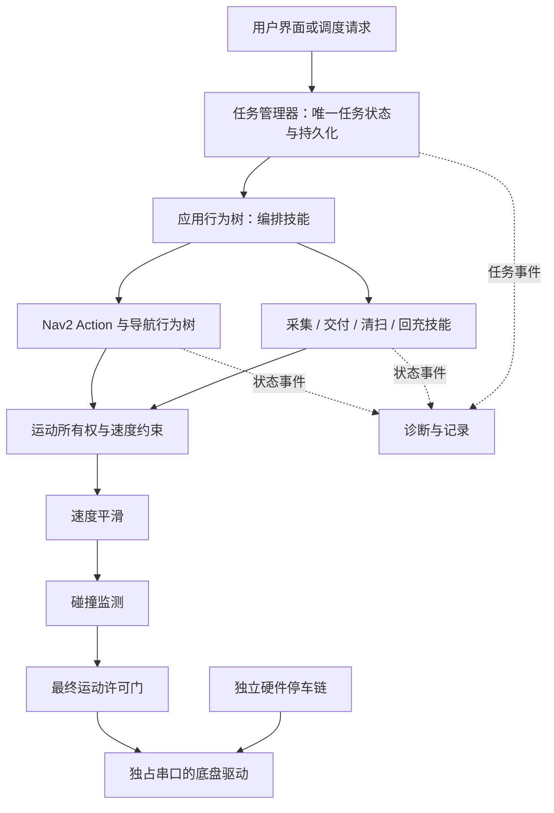

# 工业级优化建议与学习路线

审阅日期：2026-09-21。目标：从室内巡检验证平台，逐步形成可支撑清扫、送餐和工业室内移动任务的可靠软件底座。

**优先顺序：可靠停车与可信数据 → 可重复的定位导航 → 可取消、可恢复的任务 → 按场景选择算法 → 长时运行与产品化。** 工业级看限定载荷、地面、光照、障碍和故障条件下能否持续兑现任务与安全边界，不看算法数量。

本文只维护优先级、架构取舍与学习验收，不是实机通过报告，也不存放操作命令。当前事实以 [项目路线](项目现状与路线.md)、[硬件台账](硬件台账.md)、[测试记录](测试记录.md) 为准；命令只在 [操作手册](操作手册.md)。文中指标均为建议，未测数值不得固化为正式参数。

## 1. 审阅范围与证据边界

以 Git 基线 `dd2beb6` 加审阅时工作区为对象。覆盖自有包职责、正式/实验 Launch、底盘关键路径、里程计与 TF、Nav2、行为树、定位监控、日志、测试组织与依赖。第三方 SDK 与历史测试资产按入口检查，不声称逐行审计；审阅时未启动节点、未连串口。

本机只读查询：Nav2 `1.1.20`，BehaviorTree.CPP `3.8.7`，SLAM Toolbox `2.6.10`，均为 Humble 安装包。MPPI、RPP、Smac、Collision Monitor、`nav2-route` 已安装，安装≠接入或实车通过。State Lattice 独立入口已经完成插件装载与全空闲合成地图规划，仍未完成 DWB 跟随和实车对照。官方 `robot_localization` 尚未安装；仓库只准备了默认关闭的配置与入口，不启用停用的自写 EKF 草稿。网上 Rolling 文档只用于方案理解，参数与 BT 节点必须对照本机版本。

许可证不能只按框架名称概括：本机 `nav2_mppi_controller 1.1.20` 声明 MIT，`nav2_smac_planner` 与 `nav2_route` 声明 Apache-2.0。实际分发还需核查源码、第三方依赖与 NOTICE。

取舍原则：

- 现有板载闭环与纯轮式 Odom 基线应保留；历史 `carcar_hardware` 不能直接替代正式四轮驱动。
- 二维 SLAM Toolbox + AMCL 继续作为室内低速方案；不急于换三维 SLAM。
- 规划控制先统一参数与恢复可靠性，再换算法。
- 自研恢复与门控的缺口是异步取消、数据失效和运动所有权，不是“缺行为树”。离线通过不能覆盖已记录的实机失败。
- `carcar_inspection` / `carcar_algorithms` 目前几乎空包；多点导航≠完整业务。
- 尚未发现仓库级 CI 与完整导航闭环仿真。

## 2. 按优先级改进

P0 是扩大运动范围或无人值守之前的门槛；P1 是稳定单机任务所需；P2 按产品增加能力；P3 是规模化。以下是待办，不代表获准改固件、实物或系统配置。

### P0：先证明系统不会错误地继续运动

| 编号 | 必要改进 | 为什么先做 | 完成证据 |
|---|---|---|---|
| P0-01 | 区分主机命令超时与控制板独立停车 | 主机卡死时不能依赖同一主机回调停车。查清固件失联保护、独立使能/急停与上电默认 | 驱动退出、主机失联、串口断开、控制板重启的停车时间与停止距离 |
| P0-02 | 防止旧编码器数据贴上新时间戳 | 厂商缓存无接收时间/序号。停更则 Odom 标无效并撤销运动许可 | 离线注入停更、断帧、恢复、回绕；恢复前须有新鲜样本 |
| P0-03 | 冻结并完成当前恢复链路验收，不另造一套 | Action 取消接受、终态返回和物理停稳是三件事 | 按手册第 18 节验收；迟到反馈不污染新目标 |
| P0-04 | 所有运动来源经过同一出口 | 遥控/回充/业务将来可能绕过门控。许可过期必须零输出 | 发布者拓扑、许可切换、延迟消息、节点重启 |
| P0-05 | 独立于规划器的近场保护 | 优先评估已安装的 Nav2 Collision Monitor；紧急停车不能被平滑器延迟 | 合成 scan/点云；实机接近/遮挡/掉线停车距离。软件层不提供硬实时认证 |
| P0-06 | 收敛参数与文档三种状态 | 明确历史对照 / 待验收 / 当前正式。用快照记录实际加载值，不根据过期文档反改参数 | 测试绑定地图、代码、BT 和参数校验和 |

停车距离设计近似下界：`d = v × T + v² / (2a) + 误差余量`。T 含感知、通信、调度与执行延迟，a 必须来自最差载荷/地面实测减速度；转弯用完整扫掠外廓。这不是认证公式。激光有效 3 m 与低速限制，在新边界验证前应保留。

Collision Monitor 官方说明：[Nav2 Collision Monitor](https://docs.nav2.org/rolling/configuration_and_development/configuration_guide/core_servers/collision_monitor/configuring_collision_monitor_node/)。

### P1：形成稳定、可维护的单机能力

| 编号 | 改进 | 推荐做法 | 验收重点 |
|---|---|---|---|
| P1-01 | C++ 正式驱动演进 | 保留现 Python 正式驱动与历史测试入口；新增适配当前四轮板载 PID 的 C++ 入口，先影子对照再独占串口 | 单位/符号/轮位一致；上电零输出；可回滚，绝不双开串口 |
| P1-02 | Odom、协方差、时钟 | 多工况统计误差；固定协方差改为有依据估计；安全超时用单调时钟 | 真值对照；基础导航通过后才只加陀螺 Z；`odom → base_footprint` 只能一个发布者 |
| P1-03 | 定位健康判据 | 保留 AMCL + 现有监控；按遮挡、重复结构、粒子分散度校验；增加滞回 | 误放行/误停车/恢复时间；旧 latched 值不能重启后直接放行 |
| P1-04 | 规划控制统一模型 | 速度/加速度/足迹作统一基线；全局与局部膨胀可不同，但须与车体碰撞判定一致 | 门口、窄廊、墙角；完整包络检查后再对比算法 |
| P1-05 | 行为树与资源所有权 | 按第 4 节划分编排、有界 Action、运动保护 | 单/多目标同一取消语义；重试有次数和总时间上限 |
| P1-06 | 单机应用最小闭环 | 接任务 → 导航 → 到点采集/交付 → 记录 → 下一点；见第 5 节 | 重复提交不重复执行；取消可达所有在途技能 |
| P1-07 | 测试与复现 | 增加假 Action、合成传感器、场景仿真和 CI；版本清单覆盖 ROS 包、厂商库、地图 | CI 与实车域隔离；离线与实机分栏 |
| P1-08 | 可观测性 | 拆分过大的日志文件；任务状态由执行者发布，日志只消费 | 磁盘限额、缺失标记；日志停不影响控制 |

### P2 / P3：根据产品分支增加能力

| 优先级与场景 | 值得增加的能力 | 前提 | 暂不扩大 |
|---|---|---|---|
| P2，共同 | 禁行区、限速区、地图/点位版本 | 用 Costmap Filters；换图后旧任务不得落错位置 | 不靠识别网络猜可通行区 |
| P2，清扫/送餐 | 盲区传感器与机械改进 | 有跌落风险先补防跌落；重新评估轮型/制动/载荷 | 无规格与成本依据前不推荐采购型号 |
| P2，共同 | 回充闭环 | 电池状态可信后：Docking + 近场检测 + 充电电气反馈 | 不凭到达目标或看到桩就报充电成功 |
| P2，送餐 | 站点交付、平稳控制、通道策略 | 确认、超时、优先级、窄门等待 | 不把人当实验障碍 |
| P2，清扫 | 分区覆盖、沿边、漏扫、续扫 | 工作宽度与执行器状态已知；账本记实际清扫面积 | 走过的车体面积≠清洁覆盖率 |
| P2，巡检 | 采集技能、质量检查、离线上传 | 到点停稳后采集；失败重试与上传重试分开 | 不因上传失败重复运动 |
| P3，多机/多楼层 | Open-RMF、交通图、门/电梯 | 单机任务与回充稳定后再接入 | 第一版单机不引入分布式调度 |
| P3，交付运营 | 监管、权限、升级回滚、长时统计 | 启动健康检查后才允许运动 | 一次长时测试≠产品认证 |

## 3. 值得亲自比较的算法

每次只换一个模块；同一批实验不得同时换定位、控制器和恢复树。下表适用性是工程判断，收益待测。

### 3.1 状态估计、建图与定位

| 推荐路线 | 原理与优势 | 代价/失效边界 | 应观察到的差异 |
|---|---|---|---|
| 轮式 Odom → `robot_localization` EKF（只加陀螺 Z） | 轮速管平移，陀螺管角速度 | 不能消全部打滑与漂移；协方差/时间错会更差。同一编码器推导的位姿/速度不是独立证据 | 直线/转弯航向、静止漂移、闭环误差、数据失效 |
| SLAM Toolbox 建图 + AMCL 静态定位 | 建图与部署定位分开，便于审核 | 重复走廊、长时遮挡、错误初值仍可能失配 | 初值偏差、遮挡、搬动恢复；同时查误放行 |
| 有持续改图需求再评估 SLAM Toolbox 定位/地图维护 | 复用二维资产 | 临时障碍可能被固化 | 仅场地常改时与冻结地图比较 |

EKF 配置参考 [robot_localization 维护者说明](https://github.com/cra-ros-pkg/robot_localization/blob/rolling-devel/doc/configuring_robot_localization.rst)，示例不直接复制到 Humble。不安排无需求的 VIO、三维 SLAM、磁力计或 EKF/UKF 全套体验。

### 3.2 全局规划与局部控制

| 优先体验 | 优势 | 代价/边界 | 公平对照 |
|---|---|---|---|
| NavFn Dijkstra → Smac 2D A* | 已有栅格基线 vs 启发式代价感知 | 二维位置搜索不完整表达窄处姿态 | 固定地图/膨胀/起终点/控制器 |
| DWB（现有） | 短时轨迹采样 + critics | 可能振荡或无可行轨迹 | 墙角、门口、临时障碍；看 `/evaluation` |
| RPP | 几何跟随，算力低 | 主要依赖上游可行路径，不是通用绕障器 | 与 DWB 用同一可行路径 |
| MPPI | 多步控制序列，适合绕行对照 | 算力与权重需调；不自动含行人意图 | 同限速下墙角左右绕、S 弯 |
| Smac State Lattice 独立对照 | 差速运动原语同时表达前进和原地旋转，比二维位置搜索更早约束路径动作 | 原语与搜索成本更高；全局路径含原地旋转段不代表 DWB 必然能稳定执行 | 固定 DWB、地图、限速和恢复；比较路径长度、规划延迟、旋转次数、恢复耗时及“规划成功但跟随失败”次数 |

Nav2 将 RPP 定位为路径跟随，DWB/MPPI 可偏离路径避障；Rotation Shim 不是第四种规划算法。见 [插件列表](https://docs.nav2.org/rolling/configuration_and_development/navigation_plugins/) 与 [调参指南](https://docs.nav2.org/rolling/configuration_and_development/tuning_guide/)。MPPI 不因 Jetson 就自动用 GPU。

当前建议顺序：先完成 Smac 2D + DWB 的恢复基线，再用独立 State Lattice 入口只替换全局规划器；确认其路径能被同一 DWB 执行后，才讨论是否保留。RPP 与 MPPI 属于后续局部控制对照，不与本轮 Lattice 或 EKF 同时切换。暂不安排手写 DWA、人工势场独立导航、随机游走清扫或无需求的强化学习导航。

### 3.3 感知、回充、覆盖与业务调度

| 任务 | 值得学习的方案 | 优势与边界 | 可感受的结果 |
|---|---|---|---|
| 非激光平面障碍 | ObstacleLayer 基线，再接 VoxelLayer | 不依赖物体类别；深度噪声与盲区是代价。D435 现只规划用于回充 | 低矮/悬空漏检与误停 |
| 回充 | Nav2 Docking + AprilTag + 接触/充电反馈 | 标记可复现；到桩附近用导航，最后用专门技能 | 偏差对接率、失标停车、真正充电确认 |
| 清扫覆盖 | 弓字形 + 边界 + 漏扫账本；评估 Fields2Cover / opennav_coverage | 有明确面积与重叠成本，不是完整家用语义 | 转弯次数、重复率、未覆盖面积 |
| 固定通道送餐/工业 | 自由空间基线 → 拓扑交通图 | 单向与等待点更明确 | 任务时间、会车等待、可预测性 |
| 巡检感知 | 先定义缺陷类型与评价集 | 许可证须独立核查 | 任务级漏检/误报/延迟 |

来源：[Docking](https://github.com/open-navigation/opennav_docking)、[AprilTag](https://github.com/AprilRobotics/apriltag)、[opennav_coverage](https://github.com/open-navigation/opennav_coverage)、[Fields2Cover 论文](https://arxiv.org/abs/2210.07838)。不为“感知更高级”加人脸识别或大模型直接控车。

## 4. 行为树：先收敛职责，再增加业务

### 4.1 现有实现该保留什么

实验树已有定位门控、周期规划、进展守卫与有界跟随，失败后进入定位恢复、净空倒车、受控旋转或停车观察。第一步是让这些语义被实机证实，不能把重写整棵树当成修复。

先做「现有自研能力 ↔ 本机 Nav2 能力」对照：上游已覆盖的异步 Action 优先复用；本车确需的停稳、许可租约、后退保护保留为明确扩展。任何删减都必须让旧故障用例继续通过。

### 4.2 推荐分层

这是目标职责图，不是当前 Launch。导航 BT 负责一次导航内的规划、跟随和有限恢复；应用 BT 负责去哪里、到达后做什么、何时回充；任务管理器负责用户可见状态。不要把送餐确认或清扫账本塞进 Nav2 恢复树。

### 4.3 必须定义清楚的规则

1. **异步与 halt**：叶节点发起 Action 后快速返回 RUNNING；`halt()` 不能冒充已停稳。见 [BT.CPP 3.8 异步教程](https://www.behaviortree.dev/docs/3.8/tutorial-basics/tutorial_04_sequence/)。
2. **所有权与迟到结果**：任务/技能/目标分配标识与执行代次；仅新位置不足以区分同地点重试和旧回复。
3. **唯一恢复预算**：导航层有限恢复失败再报应用层；两层无限重试不得相乘。
4. **恢复前提实时有效**：倒车执行中也要检查；定位丢失、scan 过期、取消未确认时撤销许可。
5. **条件与副作用分离**：Condition 只判断；导航 `{path}` 不与业务路径列表共用含糊名。
6. **应用树不递归调用自己**：Docking 内部若还会导航，就不能再嵌套同一导航 BT。见 [Docking 约束](https://github.com/ros-navigation/docs.nav2.org/blob/rolling/docs/tutorials/general_tutorials/using_docking.md)。
7. **观察工具服从运行预算**：保留轻量日志与主机 RViz；不为学习 BT 恢复板上 Groot/VNC 常驻。

最有价值的离线实验：同一任务中插入取消、延迟反馈和传感器失效，观察 Sequence / ReactiveSequence / PipelineSequence 的 halt 时机。不拿实车试错验证并发语义。

## 5. 应用层节点与逻辑框架

优先 C++、ROS 2 Action 和小型持久化，复用 BehaviorTree.CPP。初版按职责分开即可。

| 模块（建议名，尚未实现） | 职责 | 不应承担 |
|---|---|---|
| `mission_manager` | 接任务、校验地图版本、排队、取消、持久化 | 不直接发电机命令，不根据日志猜成功 |
| `mission_executor` | 跑应用 BT，调用导航与技能 | 不另建一份任务真相 |
| `inspection_skill` / `delivery_skill` | 停稳采集 / 到站确认 | “导航到达”≠采集/交付成功 |
| `coverage_skill` | 覆盖规划、执行器、账本 | 不绕过运动保护驱动车轮 |
| `docking_adapter` | 适配 Docking Server | 不凭电压估算单独判充电完成 |
| `robot_health` | 汇总新鲜健康，给出允许启动/降级 | 不替代底层独立停车 |
| `upload_worker` | 本地待发队列、幂等上传 | 不在控制回调中等网络 |

业务状态：`QUEUED → RUNNING → SUCCEEDED/FAILED/CANCELED`，中间允许暂停/取消中/恢复中。取消只进入 CANCELING，待 Action 结束且运动停稳才进入 CANCELED。

消息至少含 `mission_id`、`execution_epoch`、`step_id`、`map_version`、`error_code`。持久化从 SQLite 事务开始：接受时落库，断电后不直接恢复旧速度。对外部物理动作不承诺跨断电恰好一次。

产品逻辑必须落在技能里：巡检到点采集上传；送餐装载/取餐确认；清扫覆盖记账后续扫。先做巡检两点验证公共骨架。

## 6. 结合项目推进的学习与验收路线

### 6.1 每一步都要有能看见的产物

| 阶段 | 学习重点 | 亲自对照 | 进入下一阶段 |
|---|---|---|---|
| L0 可信基线 | 数据年龄、时钟、速度链、停车；处理 P0 | 断帧/延迟与旧目标反馈 | 真实拓扑、配置快照、取消/停车证据 |
| L1 可重复导航 | costmap、足迹、膨胀、DWB critics、AMCL | 直道、门口、墙角、受控障碍 | 每类成功率、净空、失败归因 |
| L2 规划对照 | 运动原语、路径搜索与轨迹控制的边界 | 同一 DWB 下 Smac 2D vs State Lattice | 能量化规划成功但跟随失败、路径长度、旋转和恢复代价 |
| L3 估计对照 | EKF 测量、协方差、独立性 | 同路径纯轮式 vs 只加陀螺 Z | 输入失效可靠停车；不改善则继续纯轮式 |
| L4 BT 与单机任务 | halt、ReactiveSequence、Action 取消 | 两点巡检中取消/暂停/断网/重启 | 一个任务一个终态 |
| L5 一个产品分支 | 覆盖 / 交付 / 采集质量，选一个 | 第 3.3 节对应场景 | 任务级指标改善且停车回归仍过 |
| L6 长时与扩展 | 资源治理、回滚；多机才学 RMF | 按时长与载荷扩大 | 无长期实测则保持原型验证 |

L2 与 L3 不在同一次实车试验中切换。当前固定顺序是持续录包与 Smac 2D 基线、自适应短倒车、双向转向、3 Hz 地图与路径检查、State Lattice 对照，最后才做 EKF 对照。路线由门槛驱动，不承诺固定几周达到工业级。

### 6.2 避免“感觉更顺”的比较方法

1. 固定地图、起终点、障碍、包络、载荷、电量和限速；每轮只改一个模块；记录全部失败。
2. 每场景可先各 10 次作筛选；该样本量不能证明产品可靠性。接触禁行或取消后继续运动单独列为否决。
3. 指标分层：定位看真值与误放行；规划看耗时与净空；控制看跟随误差与急动度；任务看完成率与接管次数。展示中位数与最差值。
4. 真值须独立参考，不能用正在评估的 AMCL/Odom 自证。
5. 固定旧 bag 不能宣称闭环绕障成功。
6. 学习结果在主机展示，不增加车上负担。修改 RViz 配置时复核并在交付中列出组件、话题、Fixed Frame 和 QoS，使显示设置可追溯。
7. 每轮一张对照表和一个决策：保留 / 有条件切换 / 不采用。命令进手册，结果进测试记录。

## 7. 来源、版本与复用纪律

Nav2 官方支持、公开应用经历和本车实测是不同证据层级。

| 方案 | 当前依据 | 后续集成必须记录 |
|---|---|---|
| Nav2 / Collision Monitor | 本机 `1.1.20`；官方指南默认 Rolling | 包版本、插件名、参数是否生效、许可证 |
| BehaviorTree.CPP | 本机 `3.8.7` | 同版本 ABI、XML 与插件对应；不移植 4.x 语义 |
| SLAM Toolbox | 本机 `2.6.10` | 地图格式、依赖、许可证 |
| robot_localization | 维护者说明作原理；仓库已准备默认关闭的轮速 + 校准陀螺 Z 入口，本机包尚未安装 | 安装的 Humble 包版本、输入、协方差、时间戳、单一 TF 所有权、失效停车 |
| Docking / AprilTag | 候选，未固定版本 | tag/commit、许可证、标定、桩端适配 |
| 覆盖规划 | opennav_coverage 适配 Fields2Cover v2 | 两层版本与室内适配 |
| Open-RMF | 仅多机阶段候选 | 固定提交、接口与失联策略 |

讨论候选时可标版本待定；引入代码或权重前必须固定提交并核查许可证。不得为追新功能直接升级 Jetson 系统。

## 8. 维护方式

1. 只更新本文的优先级、取舍与学习门槛。
2. 新增现场事实写入台账与测试记录，不在本文维护实机结论表。
3. 操作命令只写入操作手册。
4. P0 未通过不扩大运动工况，也不把长期路线当作跳过当前验收的授权。
